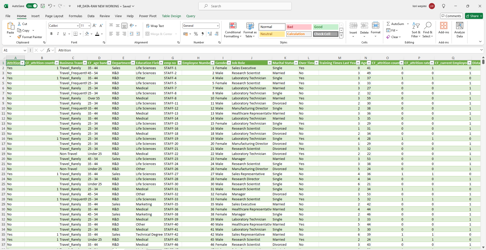

# HR Attrition Report

## Problem Statement:
The Human Resources department is grappling with high employee attrition rates, posing challenges to organizational stability and growth. A lack of clear insights into attrition drivers hampers our ability to implement effective retention strategies. Data analysis is needed to identify key factors contributing to attrition, develop predictive models, evaluate current retention initiatives, and optimize strategies for retaining valuable talent.

## Key Issues:

Identifying Attrition Patterns: 

There is a lack of comprehensive understanding regarding the underlying factors contributing to employee attrition. Without clear insights into why employees leave, it's challenging to implement effective retention strategies.
Predictive Analysis: Anticipating which employees are most likely to leave can be a game-changer. 

Predictive analytics can help in identifying potential attrition risks early, enabling proactive intervention to retain valuable talent. Retention Strategy Evaluation: Our current retention initiatives need to be assessed for effectiveness. 

Are they addressing the root causes of attrition, and how can they be optimized to yield better outcomes?

Demographic Analysis: 

Understanding if certain demographics are more prone to attrition can inform targeted interventions. Analyzing factors such as age, gender, tenure, department, and performance ratings can reveal insightful patterns.

Cost-Benefit Analysis: 

Quantifying the financial implications of attrition is crucial for decision-making. This involves not only the direct costs associated with recruitment and training but also the indirect costs related to productivity loss and decreased team morale.

## Objectives:

Identify Attrition Drivers: 

Analyze historical data to identify key factors contributing to employee attrition, such as job satisfaction, compensation, work-life balance, career growth opportunities, and managerial effectiveness.

Evaluate Retention Initiatives: 

Assess the effectiveness of existing retention initiatives through data analysis. Determine which strategies are yielding the highest retention rates and identify areas for improvement.

Conduct Demographic Analysis: 

Explore demographic trends in attrition rates to uncover any disparities or patterns that require attention. This analysis should inform tailored retention strategies for different employee segments.

Perform Cost-Benefit Analysis: 

Calculate the direct and indirect costs associated with attrition and compare them to the benefits gained from retention efforts. This analysis will provide insights into the ROI of investing in employee retention.

Deliverables:
1.	Detailed analysis reports highlighting the key drivers of attrition.
2.	Evaluation of current retention strategies and recommendations for optimization.
3.	Demographic analysis findings and corresponding retention strategies.
4.	Cost-benefit analysis report outlining the financial implications of attrition and retention efforts.

Compilation of final reports

Presentation of findings and recommendations to stakeholders
By addressing these challenges and objectives, we aim to equip the HR department with actionable insights and tools to effectively manage employee attrition and foster a more stable and engaged workforce.

## CLEANING PROCESS UPDATE COMING SOON

## STAY TUNED

## ONGOING PROJECT

# UPDATE COMING SOON

# DASHBOARD REPORT

## NOTE:

The dashboard transitions from a dark background to a light one in real-time for improved eye comfort.

